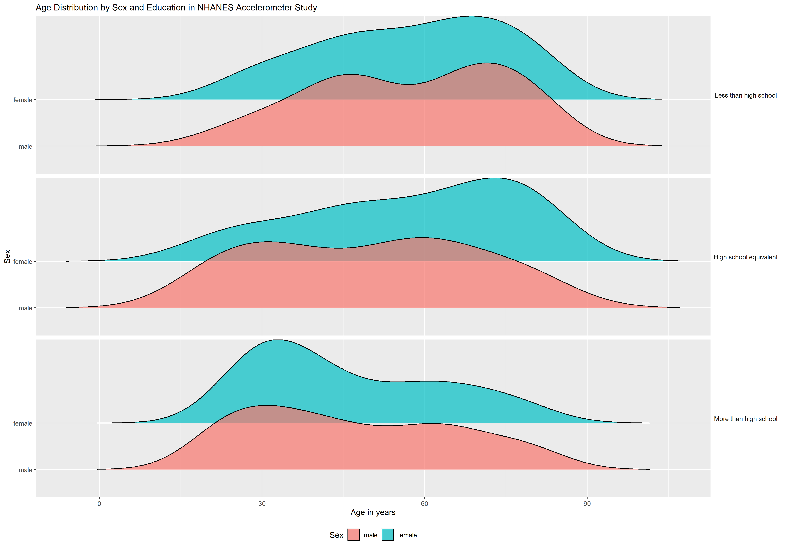
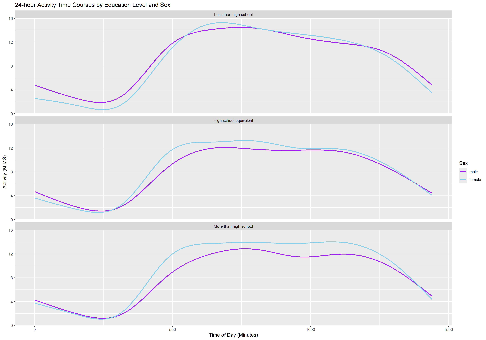
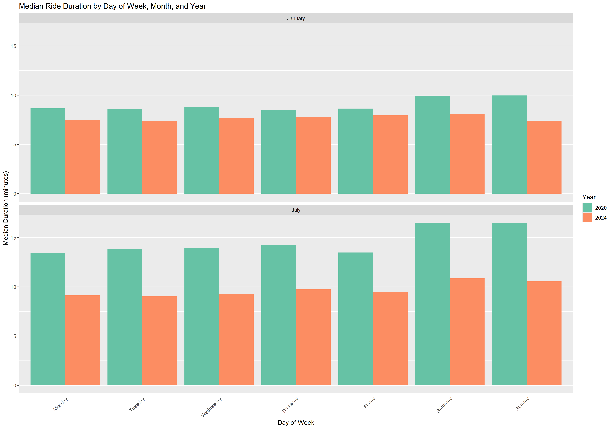

p8105_hw3_ns3782
================
NSK
2024-10-13

# Problem 1

``` r
# Load libraries and import data

library(p8105.datasets)
library(tidyverse)

data("ny_noaa")
```

## Dataset Overview

The NY NOAA dataset contains 2595176 observations of 7 weather related
variables, corresponding to daily weather data collected from 747 unique
weather stations in New York City. The date range of the observations is
from 1981-01-01 to 2010-12-31.

Key variables and their types include: `id` (character, weather station
identifier), `date` (Date, YYYY-MM-DD), `prcp` (integer, precipitation),
`snow` (integer, snowfall), `snwd` (integer, snow depth), `tmax`
(character, maximum temperature), `tmin` (character, minimum
temperature).

Missing data is an issue in this dataset. The total number of missing
values across all variables is 3387623, which represents 18.65% of all
observations in the dataset.

For the id variable, there are 0 missing values (0% of total
observations). The date variable has 0 missing values (0% of total
observations). Precipitation (prcp) has 145838 missing values (5.62% of
total observations). For snowfall (snow), there are 381221 missing
values (14.69% of total observations). Snow depth (snwd) has 591786
missing values (22.8% of total observations). Maximum temperature (tmax)
has 1134358 missing values (43.71% of total observations). Minimum
temperature (tmin) has 1134420 missing values (43.71% of total
observations).

``` r
# Data cleaning

ny_noaa_clean <- ny_noaa %>%
  mutate(
    date = as.Date(date),
    year = lubridate::year(date),
    month = lubridate::month(date),
    day = lubridate::day(date),
    prcp = prcp / 10, 
    snow = snow / 10, 
    snwd = snwd / 10,  
    tmax = as.numeric(tmax) / 10, 
    tmin = as.numeric(tmin) / 10   
  )


# Most common snowfall values
ny_noaa_clean %>%
  count(snow) %>%
  arrange(desc(n)) %>%
  head(5)
```

    ## # A tibble: 5 × 2
    ##    snow       n
    ##   <dbl>   <int>
    ## 1   0   2008508
    ## 2  NA    381221
    ## 3   2.5   31022
    ## 4   1.3   23095
    ## 5   5.1   18274

## Notes regarding data cleaning

In the process of cleaning the NOAA weather data, I undertook several
unit conversions to improve interpretability of the weather data.
Precipitation was changed from tenths of mm to mm, while snowfall and
snow depth were converted from mm to cm. These are in line with typical
measures used for these data. Maximum and minimum temperatures were also
adjusted from tenths of degrees Celsius to whole degrees Celsius. These
conversions were made to standardise units across the weather variables
and enable easier subsequent analysis.

## Most Common Snowfall values

The most common snowfall values for NYC are 0 cm (2008508 occurrences),
followed by NA (381221 occurrences). 0 is the most common, likely due to
New York City rarely having snow year round particularly in recent
years, while NA represents missing data. The next most common values are
2.5, 1.3, 5.1 cm, which are 1 inch, 0.5 inch, and 2 inches respectively.
These are indicative of typical light to moderate snowfall events, which
would be expected of New York City during colder months.

``` r
# Load libraries
library(ggplot2)

# Two-panel plot

temp_plot <- ny_noaa_clean %>%
  filter(month %in% c(1, 7), !is.na(tmax)) %>%
  group_by(id, year, month) %>%
  summarise(avg_tmax = mean(tmax, na.rm = TRUE)) %>%
  ungroup() %>%
  ggplot(aes(x = year, y = avg_tmax, group = id, color = id)) +
  geom_line(alpha = 0.3) +
  facet_wrap(~month, scales = "free_y", 
             labeller = labeller(month = c("1" = "January", "7" = "July"))) +
  labs(title = "Average Maximum Temperature in January and July by Station (Celsius)",
       x = "Year", y = "Average Max Temperature (Celsius)") +
  theme(legend.position = "none")

print(temp_plot)
```


## Average max temperature in January and in July

There are several observations based on the two-panel plot showing the
average max temperature in January and in July in each station across
years. First, expected seasonal differences in maximum temperature are
observable between the winter and summer months in New York. July
temperatures are consistently higher on average (20-35°C) than January
temperatures (-10 to 10°C). Second, January temperatures appear to have
more variability than July temperatures, which may be typical for NYC’s
climate. Third, there is a spike in maximum temperatures for July 2010.
Several stations show temperatures reaching or exceeding 30°C. This
appears to be the highest point on the entire July graph, suggesting
that July 2010 may have been the hottest July in the 30-year period
shown. Lastly, concerning outliers. The month of January shows
comparatively more extreme outliers compared to July, with some years in
January observed to have unusually low or high temperatures. This is
especially apparent around 1982, where there is a dip in temperature
below -10°C. July has fewer extreme outliers, but there is a notable dip
around 1988 for one weather station to below 15°C suggesting a
significant weather event, or weather station recording error.

``` r
# Load required libraries 

library(patchwork)
library(ggridges)
library(viridis)

# Panel 1: tmax vs tmin as a hex plot

p1_nyc_noaa_plot <- ny_noaa_clean %>%
  select(tmin, tmax) %>%
  filter(!is.na(tmin) & !is.na(tmax)) %>%
  ggplot(aes(x = tmax, y = tmin)) +
  geom_hex(bins = 30, color = "white", linewidth = 0.1) +  
  scale_fill_viridis_c(option = "mako", name = "count", direction = -1) + 
  labs(title = "Maximum and Minimum Temperatures in New York City (1981-2010)", 
       x = "Maximum temperature (Celsius)", y = "Minimum temperature (Celsius)") +
  theme_minimal() +
  theme(
    panel.grid.major = element_line(color = "gray90"),
    panel.grid.minor = element_blank(),
    legend.position = "right",
    aspect.ratio = 0.8
  ) 

# Panel 2: Ridge plot of snowfall values greater than 0 and less than 100

p2_nyc_noaa_plot <- ny_noaa_clean %>%
  filter(snow > 0, snow < 100) %>%
  ggplot(aes(x = snow, y = factor(year))) +
  geom_density_ridges(
    scale = 3, 
    bandwidth = 0.7, 
    alpha = 0.8,
    fill = "steelblue",
    color = "darkblue"
  ) +
  scale_x_continuous(limits = c(-3, 100), expand = c(0, 0)) +
  labs(title = "Distribution of Snowfall in New York City (1981-2010)", 
       x = "Snowfall (cm)", y = "Year")

# Combine plots and adjust layout

p1_nyc_noaa_plot + p2_nyc_noaa_plot +
  plot_layout(ncol = 2, widths = c(1, 1))
```


# Problem 2

``` r
# Import and clean nhanes_covar csv

nhanes_covar <- read_csv("./data/nhanes_covar.csv", skip = 4) %>% 
  janitor::clean_names() 

# Import and clean results nhanes_accel csv

nhanes_accel <- read_csv("./data/nhanes_accel.csv") %>% 
  janitor::clean_names() 

# Merge datasets

nhanes_merged <- nhanes_covar %>%
  left_join(nhanes_accel, by = "seqn")

# Exclude participants less than 21 years of age and missing demographic data

nhanes_cleaned <- nhanes_merged %>%
  filter(age >= 21) %>%
  drop_na(sex, age, bmi, education)

# Check variable types

str(nhanes_cleaned, list.len = 10)
```

    ## tibble [228 × 1,445] (S3: tbl_df/tbl/data.frame)
    ##  $ seqn     : num [1:228] 62161 62164 62169 62174 62177 ...
    ##  $ sex      : num [1:228] 1 2 1 1 1 1 1 1 2 1 ...
    ##  $ age      : num [1:228] 22 44 21 80 51 80 35 26 30 57 ...
    ##  $ bmi      : num [1:228] 23.3 23.2 20.1 33.9 20.1 28.5 27.9 22.1 22.4 28 ...
    ##  $ education: num [1:228] 2 3 2 3 2 2 3 2 3 3 ...
    ##  $ min1     : num [1:228] 1.11 1.92 5.85 5.42 6.14 ...
    ##  $ min2     : num [1:228] 3.12 1.67 5.18 3.48 8.06 ...
    ##  $ min3     : num [1:228] 1.47 2.38 4.76 3.72 9.99 ...
    ##  $ min4     : num [1:228] 0.938 0.935 6.482 3.808 6.598 ...
    ##  $ min5     : num [1:228] 1.6 2.59 6.85 6.85 4.57 ...
    ##   [list output truncated]

``` r
# Code variable classes

nhanes_cleaned <- nhanes_cleaned %>%
  mutate(
    sex = factor(sex, 
                 levels = c(1, 2), 
                 labels = c("male", "female")),
    education = factor(education, 
                       levels = c(1, 2, 3),
                       labels = c("Less than high school", 
                                  "High school equivalent", 
                                  "More than high school"),
                       ordered = TRUE)
  )
```

## Data Cleaning Process

As part of the initial data wrangling process for Problem 2, I imported
two datasets containing relevant NHANES study information, including
demographic information (nhanes_covar) and accelerometer datasets
(nhanes_accel). I proceeded to clean variable names in both using the
janitor function. Subsequently, I merged these datasets using a left
join on the ‘seqn’ variable, as this represents the sequence number or
unique identifier for each observation (participant) in NHANES. The
resulting dataset was filtered to include only participants aged 21 and
older as specified, and rows with missing demographic data were removed.
Finally, I recoded the ‘sex’ and ‘education’ variables as factors with
appropriate labels, with ‘education’ set as an ordered factor. This
process resulted in a clean, merged dataset ready for analysis, with
properly formatted categorical variables for sex and education level.

``` r
# Load and install necessary package

library(knitr)

# Create summary table

education_sex_table <- nhanes_cleaned %>%
  group_by(education, sex) %>%
  summarise(count = n(), .groups = 'drop') %>%
  pivot_wider(names_from = sex, values_from = count) %>%
  mutate(Total = male + female) %>%
  rename(Male = male, Female = female) %>%
  bind_rows(
    summarise(., education = "Total", 
              Male = sum(Male, na.rm = TRUE), 
              Female = sum(Female, na.rm = TRUE), 
              Total = sum(Total, na.rm = TRUE))
  )

# Display the table

kable(education_sex_table, caption = "NHANES Accelerometer Study: Participant Count by Sex and Education Level") 
```

| education              | Male | Female | Total |
|:-----------------------|-----:|-------:|------:|
| Less than high school  |   27 |     28 |    55 |
| High school equivalent |   35 |     23 |    58 |
| More than high school  |   56 |     59 |   115 |
| Total                  |  118 |    110 |   228 |

NHANES Accelerometer Study: Participant Count by Sex and Education Level

## NHANES Accelerometer Study: Participant Count by Sex and Education Level

The table shows the distribution participants in the NHANES
Accelerometer Study across sex and education levels. A total of 228
participants are observed. There is relatively balanced representation
of males (118) and females (110) in this sample. In each education
group, there is an approximately equal number of males and females, with
exception of the high school equivalent group where there are more males
than females. There appears to be a greater number of participants with
higher education in this sample, as noted by the number of participants
with advanced education compared to those with less than high school or
equivalent, which may reflect broader educational trends or potential
selection bias in the study. Approximately half of the participants
(115) have more than a high school education, indicating a skew towards
higher education levels in the sample.

``` r
# Plot age distribution by sex and education level

ggplot(nhanes_cleaned, aes(x = age, y = sex, fill = sex)) + 
  geom_density_ridges(alpha = 0.7) +
  facet_wrap(~ education, ncol = 1, strip.position = "right") + 
  labs(y = "Sex",
       x = "Age in years",
       fill = "Sex",
       title = "Age Distribution by Sex and Education in NHANES Accelerometer Study")  +
  theme(
    strip.text.y.right = element_text(angle = 0),  
    strip.background = element_blank(),
    legend.position = "bottom", 
    legend.box = "horizontal", 
    plot.title = element_text(size = 12) 
  )
```



## NHANES Accelerometer Study: Age Distribution by Sex and Education Level

The ridge plot shows varying age distributions across education levels
and sexes in the NHANES Accelerometer Study. For those with less than
high school education, the age distribution skews older for both sexes,
with a peak around 60-70 years. The high school equivalent category
shows a more uniform age spread, particularly for males. A noteworthy
observation is that the “More than high school” group skews
comparatively younger in age compared to the other education groups,
especially for females, with a pronounced peak around 30-40 years. This
suggests generational differences in educational attainment, with a
greater number of younger participants, especially young females, having
higher education levels in the current sample. The plot also reveals sex
differences, particularly in higher education, where females show a
stronger representation in younger age groups compared to males. These
observations align with the participant counts in the accompanying
table, which shows a higher number of participants (115) in the “More
than high school” category.

``` r
# Calculate total activity and add it to nhanes_cleaned

nhanes_cleaned <- nhanes_cleaned %>%
  rowwise() %>%
  mutate(total_activity = sum(c_across(min1:min1440), na.rm = TRUE)) %>%
  ungroup()

# Create the plot

ggplot(nhanes_cleaned, aes(x = age, y = total_activity, color = sex)) +
  geom_point(alpha = 0.6) +
  geom_smooth(method = "loess", se = FALSE) +
  facet_wrap(~ education, ncol = 1) +
  scale_color_manual(values = c("male" = "purple", "female" = "skyblue")) +
  labs(title = "Total Daily Activity vs Age by Sex and Education Level",
       x = "Age (years)",
       y = "Total Daily Activity (MIMS)",
       color = "Sex") 
```


## Total Daily Activity vs Age, by Sex and Education Level

Based on the plot, there is a general observable trend of decreasing
activity with age across the different education categories, though this
rate of and extent of decline varies depending on sex and education
level. In the “Less than high school” group, men appear to have slightly
higher activity levels than women in middle age, which declines to be
close to equivalent in old age (70-80 years). The “High school
equivalent” category shows that females tend to have higher activity
levels in in their 20s, declining to have similar activity levels to
males around age 60. The “More than high school” group shows a similar
distribution of activity levels between the sexes. However, around age
50 females have a slight spike in activity levels compared to men. This
difference then declines, and by age 80, the activity levels between
sexes in this education group become similar.

``` r
# Pivot dataset from wide to long to get minute var

nhanes_long <- nhanes_cleaned %>%
  pivot_longer(cols = starts_with("min"), 
               names_to = "minute", 
               values_to = "activity",
               names_prefix = "min") %>%
  mutate(minute = as.numeric(minute))

# Create three-panel plot

ggplot(nhanes_long, aes(x = minute, y = activity, color = sex)) +
  geom_smooth(se = FALSE) +
  facet_wrap(~ education, ncol = 1) +
scale_x_continuous(breaks = seq(0, 1440, 180),
                     labels = c("00:00", "03:00", "06:00", "09:00", "12:00", "15:00", "18:00", "21:00", "24:00")) +
  scale_color_manual(values = c("male" = "purple", "female" = "skyblue")) +
  labs(title = "24-hour Activity Time Courses by Education Level and Sex",
       x = "Time of Day",
       y = "Activity (MIMS)",
       color = "Sex")
```



## 24-hour Activity Time Courses by Education Level and Sex

Overall, based on the three-panel plot, there is a common daily rhythm
observed all education levels, with activity lowest during night hours,
sharply increasing around 6:00 AM, and gradually declining towards the
evening and nighttime hours.

In the “Less than high school” group, activity patterns are similar
between males and females, with males showing slightly higher activity
during night hours. The “High school equivalent” category displays a
more pronounced difference, with females demonstrating higher activity
levels throughout most of the day, particularly from mid-morning to
early evening. Further, this trend is also more notable in the “More
than high school” group, where females consistently show higher activity
levels across the entire day. However, the “More than high school” group
maintains higher activity levels for a longer period during the day
compared to other groups. Overall, these data suggest higher education
levels are associated with more pronounced sex-based differences in
activity, which may be linked to occupational or lifestyle activities
differing between these groups.

# Problem 3

``` r
# Import and clean Jan 2020 csv

citi_jan2020 <- read_csv("./data/Jan 2020 Citi.csv") %>% 
  janitor::clean_names() 

# Import and clean results Jan 2024 csv

citi_jan2024 <- read_csv("./data/Jan 2024 Citi.csv") %>% 
  janitor::clean_names() 

# Import and clean July 2020 csv

citi_july2020 <- read_csv("./data/July 2020 Citi.csv") %>% 
  janitor::clean_names() 

# Import and clean results July 2024 csv

citi_july2024 <- read_csv("./data/July 2024 Citi.csv") %>% 
  janitor::clean_names() 

# Check to see variable names and data types in each dataset f

map(list(citi_jan2020, citi_jan2024, citi_july2020, citi_july2024), names)
```

    ## [[1]]
    ## [1] "ride_id"            "rideable_type"      "weekdays"          
    ## [4] "duration"           "start_station_name" "end_station_name"  
    ## [7] "member_casual"     
    ## 
    ## [[2]]
    ## [1] "ride_id"            "rideable_type"      "weekdays"          
    ## [4] "duration"           "start_station_name" "end_station_name"  
    ## [7] "member_casual"     
    ## 
    ## [[3]]
    ## [1] "ride_id"            "rideable_type"      "weekdays"          
    ## [4] "duration"           "start_station_name" "end_station_name"  
    ## [7] "member_casual"     
    ## 
    ## [[4]]
    ## [1] "ride_id"            "rideable_type"      "weekdays"          
    ## [4] "duration"           "start_station_name" "end_station_name"  
    ## [7] "member_casual"

``` r
map(list(citi_jan2020, citi_jan2024, citi_july2020, citi_july2024), sapply, class)
```

    ## [[1]]
    ##            ride_id      rideable_type           weekdays           duration 
    ##        "character"        "character"        "character"          "numeric" 
    ## start_station_name   end_station_name      member_casual 
    ##        "character"        "character"        "character" 
    ## 
    ## [[2]]
    ##            ride_id      rideable_type           weekdays           duration 
    ##        "character"        "character"        "character"          "numeric" 
    ## start_station_name   end_station_name      member_casual 
    ##        "character"        "character"        "character" 
    ## 
    ## [[3]]
    ##            ride_id      rideable_type           weekdays           duration 
    ##        "character"        "character"        "character"          "numeric" 
    ## start_station_name   end_station_name      member_casual 
    ##        "character"        "character"        "character" 
    ## 
    ## [[4]]
    ##            ride_id      rideable_type           weekdays           duration 
    ##        "character"        "character"        "character"          "numeric" 
    ## start_station_name   end_station_name      member_casual 
    ##        "character"        "character"        "character"

``` r
# Merge datasets

citi_rides_full <- bind_rows(
  citi_jan2020 %>% mutate(year = 2020, month = "January"),
  citi_jan2024 %>% mutate(year = 2024, month = "January"),
  citi_july2020 %>% mutate(year = 2020, month = "July"),
  citi_july2024 %>% mutate(year = 2024, month = "July")
)
```

## Dataset Overview

The final Citi Bike rides dataset for New York City contains 99485 rows
and 9 columns.

Key variables include `ride_id` (character), a unique identifier for
each ride; `rideable_type` (character), indicating the type of bike
used; `weekdays` (character), showing the day of the week; `duration`
(numeric), representing the length of the ride in minutes;
`start_station_name` and `end_station_name` (both character),
representing the names of the starting and ending stations respectively;
`member_casual` (character), indicating the rider’s membership status;
and `year` and `month` (both numeric), indicating when the ride took
place.

The total number of missing values across all variables is 250, which
represents 0.03% of all observations in the dataset.

``` r
# Load janitor library

library(janitor)

# Create table of ride counts

citi_rides_full %>% 
  mutate(Period = paste(year, month)) %>%
  tabyl(Period, member_casual) %>%
  adorn_totals("row") %>%
  adorn_totals("col") %>%
  rename("Casual Riders" = casual, "Members" = member) %>%
  kable(caption = "Total number of Citi Bike rides (Jan 2020, July 2020, Jan 2024, July 2024) by rider status")
```

| Period       | Casual Riders | Members | Total |
|:-------------|--------------:|--------:|------:|
| 2020 January |           984 |   11436 | 12420 |
| 2020 July    |          5637 |   15411 | 21048 |
| 2024 January |          2108 |   16753 | 18861 |
| 2024 July    |         10894 |   36262 | 47156 |
| Total        |         19623 |   79862 | 99485 |

Total number of Citi Bike rides (Jan 2020, July 2020, Jan 2024, July
2024) by rider status

## Citi Bike Rides by Rider Status (Jan 2020, July 2020, Jan 2024, July 2024)

Based on the table, there appears to be a seasonal trend in citi bike
usage in New York. July has higher ridership than January in both 2020
and 2024, indicating people are not using citi bikes as frequently
during winter.

Overall, there has been a major increase in citibike usage from 2020,
with total rides more than tripling from January 2020 to July 2024 (as
the total rides went from `12,420` in January 2020 to `47,156` in July
2024). While regular members comprise the majority of riders across all
periods, the proportion of casual riders appears to have increased over
time, particularly in July 2024 where casual riders made up 23.1% of
total rides, suggesting the rising popularity of Citi Bike among new
users between 2020-2024.

## Five most popular Citi Bike starting stations in July 2024

``` r
# Create table of count rides per starting station (July 2024)

citi_rides_full %>%
  filter(month == "July" & year == "2024") %>%
  count(start_station_name, sort = TRUE) %>%
  top_n(5, n) %>%
  rename("Starting Station" = start_station_name, "Number of Rides" = n) %>%
  kable(caption = "5 most popular Citi Bike starting stations in July 2024")
```

| Starting Station         | Number of Rides |
|:-------------------------|----------------:|
| Pier 61 at Chelsea Piers |             163 |
| University Pl & E 14 St  |             155 |
| W 21 St & 6 Ave          |             152 |
| West St & Chambers St    |             150 |
| W 31 St & 7 Ave          |             146 |

5 most popular Citi Bike starting stations in July 2024

Based on the data, it appears that Pier 61 at Chelsea Piers was the most
popular starting point for Citi Bike users in July 2024

``` r
citi_rides_full %>%
  mutate(
    weekday = factor(weekdays, levels = c("Monday", "Tuesday", "Wednesday", "Thursday", "Friday", "Saturday", "Sunday")),
    year = factor(year)
  ) %>%
  group_by(year, month, weekday) %>%
  summarise(median_duration = median(duration), .groups = 'drop') %>%
  ggplot(aes(x = weekday, y = median_duration, fill = year)) +
  geom_bar(stat = "identity", position = "dodge") +
  facet_wrap(~ month, ncol = 1) +
  labs(
    title = "Median Ride Duration by Day of Week, Month, and Year",
    x = "Day of Week",
    y = "Median Duration (minutes)",
    fill = "Year"
  ) +
  theme(
    axis.text.x = element_text(angle = 45, hjust = 1),
    panel.grid.major.x = element_blank(),
    panel.grid.minor.x = element_blank()
  ) +
  scale_fill_brewer(palette = "Set2")
```


\## Median Citi Bike Ride Duration by Day of Week, Month, and Year

In January, median ride durations are consistently shorter compared to
July for both 2020 and 2024, likely due to the colder weather
discouraging longer rides. There is a noticeable weekend effect in both
months, with Saturday and Sunday showing longer median ride durations in
both 2020 and 2024, which suggests people may have longer rides for
recreational purposes.

Interestingly, ride durations in 2024 are generally shorter than in 2020
across all days and both months, which may be influenced by the impact
of the COVID-19 pandemic in 2020. People may have utilised citi bikes
for longer rides as an alternative to public transport or as a form of
exercise when other options were limited. The difference between weekday
and weekend ride durations is more pronounced in July than in January,
which may be influenced by better weather conditions encouraging longer
recreational rides in the summer.
