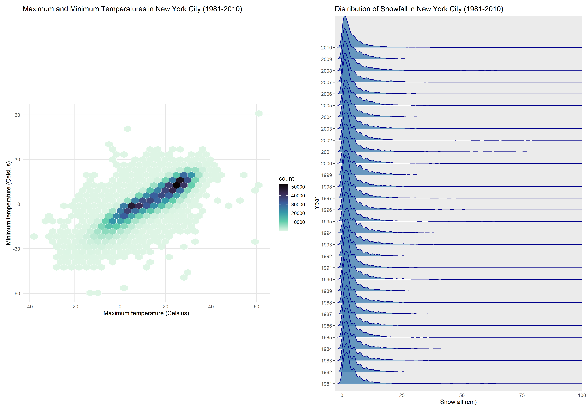

p8105_hw3_ns3782
================
NSK
2024-10-13

# Problem 1

``` r
# Load libraries and import data

library(p8105.datasets)
library(tidyverse)

data("ny_noaa")
```

## Dataset Overview

The NY NOAA dataset contains 2595176 observations of 7 weather related
variables, corresponding to daily weather data collected from 747 unique
weather stations in New York City. The date range of the observations is
from 1981-01-01 to 2010-12-31.

Key variables and their types include: `id` (character, weather station
identifier), `date` (Date, YYYY-MM-DD), `prcp` (integer, precipitation),
`snow` (integer, snowfall), `snwd` (integer, snow depth), `tmax`
(character, maximum temperature), `tmin` (character, minimum
temperature).

Missing data is an issue in this dataset. The total number of missing
values across all variables is 3387623, which represents 18.65% of all
observations in the dataset.

For the id variable, there are 0 missing values (0% of total
observations). The date variable has 0 missing values (0% of total
observations). Precipitation (prcp) has 145838 missing values (5.62% of
total observations). For snowfall (snow), there are 381221 missing
values (14.69% of total observations). Snow depth (snwd) has 591786
missing values (22.8% of total observations). Maximum temperature (tmax)
has 1134358 missing values (43.71% of total observations). Minimum
temperature (tmin) has 1134420 missing values (43.71% of total
observations).

``` r
# Data cleaning

ny_noaa_clean <- ny_noaa %>%
  mutate(
    date = as.Date(date),
    year = lubridate::year(date),
    month = lubridate::month(date),
    day = lubridate::day(date),
    prcp = prcp / 10, 
    snow = snow / 10, 
    snwd = snwd / 10,  
    tmax = as.numeric(tmax) / 10, 
    tmin = as.numeric(tmin) / 10   
  )


# Most common snowfall values
ny_noaa_clean %>%
  count(snow) %>%
  arrange(desc(n)) %>%
  head(5)
```

    ## # A tibble: 5 × 2
    ##    snow       n
    ##   <dbl>   <int>
    ## 1   0   2008508
    ## 2  NA    381221
    ## 3   2.5   31022
    ## 4   1.3   23095
    ## 5   5.1   18274

## Notes regarding data cleaning

In the process of cleaning the NOAA weather data, I undertook several
unit conversions to improve interpretability of the weather data.
Precipitation was changed from tenths of mm to mm, while snowfall and
snow depth were converted from mm to cm. These are in line with typical
measures used for these data. Maximum and minimum temperatures were also
adjusted from tenths of degrees Celsius to whole degrees Celsius. These
conversions were made to standardise units across the weather variables
and enable easier subsequent analysis.

## Most Common Snowfall values

The most common snowfall values for NYC are 0 cm (2008508 occurrences),
followed by NA (381221 occurrences). 0 is the most common, likely due to
New York City rarely having snow year round particularly in recent
years, while NA represents missing data. The next most common values are
2.5, 1.3, 5.1 cm, which are 1 inch, 0.5 inch, and 2 inches respectively.
These are indicative of typical light to moderate snowfall events, which
would be expected of New York City during colder months.

``` r
# Load libraries
library(ggplot2)

# Two-panel plot

temp_plot <- ny_noaa_clean %>%
  filter(month %in% c(1, 7), !is.na(tmax)) %>%
  group_by(id, year, month) %>%
  summarise(avg_tmax = mean(tmax, na.rm = TRUE)) %>%
  ungroup() %>%
  ggplot(aes(x = year, y = avg_tmax, group = id, color = id)) +
  geom_line(alpha = 0.3) +
  facet_wrap(~month, scales = "free_y", 
             labeller = labeller(month = c("1" = "January", "7" = "July"))) +
  labs(title = "Average Maximum Temperature in January and July by Station (Celsius)",
       x = "Year", y = "Average Max Temperature (Celsius)") +
  theme(legend.position = "none")

print(temp_plot)
```


## Average max temperature in January and in July

There are several observations based on the two-panel plot showing the
average max temperature in January and in July in each station across
years. First, expected seasonal differences in maximum temperature are
observable between the winter and summer months in New York. July
temperatures are consistently higher on average (20-35°C) than January
temperatures (-10 to 10°C). Second, January temperatures appear to have
more variability than July temperatures, which may be typical for NYC’s
climate. Third, there is a spike in maximum temperatures for July 2010.
Several stations show temperatures reaching or exceeding 30°C. This
appears to be the highest point on the entire July graph, suggesting
that July 2010 may have been the hottest July in the 30-year period
shown. Lastly, concerning outliers. The month of January shows
comparatively more extreme outliers compared to July, with some years in
January observed to have unusually low or high temperatures. This is
especially apparent around 1982, where there is a dip in temperature
below -10°C. July has fewer extreme outliers, but there is a notable dip
around 1988 for one weather station to below 15°C suggesting a
significant weather event, or weather station recording error.

``` r
# Load required libraries 

library(patchwork)
library(ggridges)
library(viridis)

# Panel 1: tmax vs tmin as a hex plot

p1_nyc_noaa_plot <- ny_noaa_clean %>%
  select(tmin, tmax) %>%
  filter(!is.na(tmin) & !is.na(tmax)) %>%
  ggplot(aes(x = tmax, y = tmin)) +
  geom_hex(bins = 30, color = "white", linewidth = 0.1) +  
  scale_fill_viridis_c(option = "mako", name = "count", direction = -1) + 
  labs(title = "Maximum and Minimum Temperatures in New York City (1981-2010)", 
       x = "Maximum temperature (Celsius)", y = "Minimum temperature (Celsius)") +
  theme_minimal() +
  theme(
    panel.grid.major = element_line(color = "gray90"),
    panel.grid.minor = element_blank(),
    legend.position = "right",
    aspect.ratio = 0.8
  ) 

# Panel 2: Ridge plot of snowfall values greater than 0 and less than 100

p2_nyc_noaa_plot <- ny_noaa_clean %>%
  filter(snow > 0, snow < 100) %>%
  ggplot(aes(x = snow, y = factor(year))) +
  geom_density_ridges(
    scale = 3, 
    bandwidth = 0.7, 
    alpha = 0.8,
    fill = "steelblue",
    color = "darkblue"
  ) +
  scale_x_continuous(limits = c(0, 100), expand = c(0, 0)) +
  labs(title = "Distribution of Snowfall in New York City (1981-2010)", 
       x = "Snowfall (cm)", y = "Year")

# Combine plots and adjust layout

p1_nyc_noaa_plot + p2_nyc_noaa_plot +
  plot_layout(ncol = 2, widths = c(1, 1))
```



# Problem 2

``` r
# Import and clean nhanes_covar csv

nhanes_covar <- read_csv("./data/nhanes_covar.csv", skip = 4) %>% 
  janitor::clean_names() 

# Import and clean results nhanes_accel csv

nhanes_accel <- read_csv("./data/nhanes_accel.csv") %>% 
  janitor::clean_names() 

# Merge datasets

nhanes_merged <- nhanes_covar %>%
  left_join(nhanes_accel, by = "seqn")

# Exclude participants less than 21 years of age and missing demographic data

nhanes_cleaned <- nhanes_merged %>%
  filter(age >= 21) %>%
  drop_na(sex, age, bmi, education)

# Check variable types

str(nhanes_cleaned)
```

    ## tibble [228 × 1,445] (S3: tbl_df/tbl/data.frame)
    ##  $ seqn     : num [1:228] 62161 62164 62169 62174 62177 ...
    ##  $ sex      : num [1:228] 1 2 1 1 1 1 1 1 2 1 ...
    ##  $ age      : num [1:228] 22 44 21 80 51 80 35 26 30 57 ...
    ##  $ bmi      : num [1:228] 23.3 23.2 20.1 33.9 20.1 28.5 27.9 22.1 22.4 28 ...
    ##  $ education: num [1:228] 2 3 2 3 2 2 3 2 3 3 ...
    ##  $ min1     : num [1:228] 1.11 1.92 5.85 5.42 6.14 ...
    ##  $ min2     : num [1:228] 3.12 1.67 5.18 3.48 8.06 ...
    ##  $ min3     : num [1:228] 1.47 2.38 4.76 3.72 9.99 ...
    ##  $ min4     : num [1:228] 0.938 0.935 6.482 3.808 6.598 ...
    ##  $ min5     : num [1:228] 1.6 2.59 6.85 6.85 4.57 ...
    ##  $ min6     : num [1:228] 0.145 5.221 7.242 4.449 2.783 ...
    ##  $ min7     : num [1:228] 2.1 2.393 6.115 0.561 7.104 ...
    ##  $ min8     : num [1:228] 0.509 4.902 7.484 1.608 7.253 ...
    ##  $ min9     : num [1:228] 1.632 1.968 5.471 0.698 10.127 ...
    ##  $ min10    : num [1:228] 1.2 3.13 6.49 2.72 7.49 ...
    ##  $ min11    : num [1:228] 0.947 2.771 5.135 4.845 2.718 ...
    ##  $ min12    : num [1:228] 0.0263 2.4539 3.5134 0.5777 2.3941 ...
    ##  $ min13    : num [1:228] 0.0552 2.1964 5.4329 1.174 2.2013 ...
    ##  $ min14    : num [1:228] 0.037 3.079 3.836 2.801 0.85 ...
    ##  $ min15    : num [1:228] 2.1 7.72 10.22 1.06 3.3 ...
    ##  $ min16    : num [1:228] 0.543 9.464 6.942 0.029 2.918 ...
    ##  $ min17    : num [1:228] 0.0915 6.8507 5.9619 0.9488 3.6746 ...
    ##  $ min18    : num [1:228] 0.97 5.5 8.16 2.68 7.59 ...
    ##  $ min19    : num [1:228] 0.814 6.11 14.2 4.881 6.248 ...
    ##  $ min20    : num [1:228] 0.965 3.443 8.693 0.127 5.79 ...
    ##  $ min21    : num [1:228] 0.0478 3.5679 25.992 2.5968 3.3457 ...
    ##  $ min22    : num [1:228] 1.86 1.47 9.24 5.02 3.32 ...
    ##  $ min23    : num [1:228] 1.08 3.1 6.63 1.65 3.01 ...
    ##  $ min24    : num [1:228] 1.03 1.77 5.1 5.26 4.18 ...
    ##  $ min25    : num [1:228] 1.23 3.28 4.78 4.72 2.24 ...
    ##  $ min26    : num [1:228] 2.29 4.53 8.48 5.02 3.79 ...
    ##  $ min27    : num [1:228] 0.0607 2.5034 7.4079 4.7187 5.7221 ...
    ##  $ min28    : num [1:228] 0.0533 1.3331 4.4674 6.8562 5.5306 ...
    ##  $ min29    : num [1:228] 0.103 0.765 5.384 2.806 12.468 ...
    ##  $ min30    : num [1:228] 0.0907 5.9849 3.7921 4.3602 5.6324 ...
    ##  $ min31    : num [1:228] 0.309 3.25 5.987 3.357 1.305 ...
    ##  $ min32    : num [1:228] 0.4 0.745 4.218 1.742 2.748 ...
    ##  $ min33    : num [1:228] 1.234 0.99 3.491 1.998 0.395 ...
    ##  $ min34    : num [1:228] 0.033 1.342 3.624 0.98 1.554 ...
    ##  $ min35    : num [1:228] 3.0613 3.5911 5.953 0.0155 0.6207 ...
    ##  $ min36    : num [1:228] 1.723 5.063 7.598 0.457 0.247 ...
    ##  $ min37    : num [1:228] 0.0605 4.642 7.6967 0.6662 1.5099 ...
    ##  $ min38    : num [1:228] 4.22 5.02 6.34 1.05 1.69 ...
    ##  $ min39    : num [1:228] 0.805 2.664 20.129 0.02 3.07 ...
    ##  $ min40    : num [1:228] 0.898 1.363 10.044 0.507 4.033 ...
    ##  $ min41    : num [1:228] 1.7445 2.4273 4.4081 0.0427 2.1993 ...
    ##  $ min42    : num [1:228] 1.506 5.165 8.664 0.756 0.69 ...
    ##  $ min43    : num [1:228] 0.857 6.527 10.432 1.763 1.255 ...
    ##  $ min44    : num [1:228] 1.03 3.22 6.75 3.29 3.02 ...
    ##  $ min45    : num [1:228] 0.0495 6.4894 3.8894 0.0893 2.7264 ...
    ##  $ min46    : num [1:228] 0.137 6.602 3.976 0.732 7.687 ...
    ##  $ min47    : num [1:228] 0.911 2.535 3.47 1.363 1.78 ...
    ##  $ min48    : num [1:228] 0.299 3.532 5.168 0.117 1.399 ...
    ##  $ min49    : num [1:228] 0.364 2.365 5.692 0.759 1.329 ...
    ##  $ min50    : num [1:228] 0.0455 1.0396 5.194 0.5965 3.2546 ...
    ##  $ min51    : num [1:228] 0.0307 0.805 3.5296 0.419 2.827 ...
    ##  $ min52    : num [1:228] 2.216 0.722 6.174 0.147 2.251 ...
    ##  $ min53    : num [1:228] 0.0577 1.1586 7.8921 1.7413 0.3917 ...
    ##  $ min54    : num [1:228] 1.216 1.243 7.589 2.286 0.631 ...
    ##  $ min55    : num [1:228] 0.0765 1.2767 6.3474 4.3313 0.7009 ...
    ##  $ min56    : num [1:228] 0.0638 1.2551 5.1994 0.1208 1 ...
    ##  $ min57    : num [1:228] 0.532 0.6137 5.814 0.0183 2.2229 ...
    ##  $ min58    : num [1:228] 0.0448 0.7019 8.0919 0.698 3.5767 ...
    ##  $ min59    : num [1:228] 0.094 4.954 6.623 0.084 2.911 ...
    ##  $ min60    : num [1:228] 0.0273 4.0599 5.9017 0.5968 5.567 ...
    ##  $ min61    : num [1:228] 0.922 9.251 6.438 0.015 2.355 ...
    ##  $ min62    : num [1:228] 0.0378 2.8973 6.4271 0.0157 4.0069 ...
    ##  $ min63    : num [1:228] 0.15 1.871 5.103 0.183 3.47 ...
    ##  $ min64    : num [1:228] 0.0922 1.1697 5.1356 0.7497 2.7854 ...
    ##  $ min65    : num [1:228] 0.378 2.625 4.541 0.031 5.24 ...
    ##  $ min66    : num [1:228] 0.0377 2.476 5.7209 0.0307 4.8513 ...
    ##  $ min67    : num [1:228] 1.1283 2.3359 4.7034 0.0422 3.4093 ...
    ##  $ min68    : num [1:228] 0.123 4.983 6.667 0.873 4.443 ...
    ##  $ min69    : num [1:228] 1.21 3.26 5.61 5.84 7.37 ...
    ##  $ min70    : num [1:228] 0.0503 4.6211 3.496 6.2575 2.9409 ...
    ##  $ min71    : num [1:228] 0.0243 3.8281 3.5521 4.0658 3.1709 ...
    ##  $ min72    : num [1:228] 0.0543 2.0437 6.0114 4.9895 3.302 ...
    ##  $ min73    : num [1:228] 0.0273 1.0824 4.949 0.4662 10.2747 ...
    ##  $ min74    : num [1:228] 0.68 6.02 5.52 1.11 1.14 ...
    ##  $ min75    : num [1:228] 0.0512 5.1124 5.4481 6.5372 2.0353 ...
    ##  $ min76    : num [1:228] 0.747 7.646 6.168 5.703 2.457 ...
    ##  $ min77    : num [1:228] 0.743 6.181 5.776 0.41 1.793 ...
    ##  $ min78    : num [1:228] 1.26 4.77 10.52 1.04 3.82 ...
    ##  $ min79    : num [1:228] 0.854 4.373 7.089 0.359 3.331 ...
    ##  $ min80    : num [1:228] 1.166 4.56 7.959 0.931 4.177 ...
    ##  $ min81    : num [1:228] 0.206 1.921 7.116 0.237 5.08 ...
    ##  $ min82    : num [1:228] 0.824 2.648 4.855 1.529 2.02 ...
    ##  $ min83    : num [1:228] 0.115 2.168 7.518 5.599 5.898 ...
    ##  $ min84    : num [1:228] 1.06 1.32 9.21 3.2 3.3 ...
    ##  $ min85    : num [1:228] 3.76 2.75 5.03 3.3 1.23 ...
    ##  $ min86    : num [1:228] 6.86 1.85 4.4 2.96 6.24 ...
    ##  $ min87    : num [1:228] 5.949 1.477 9.568 0.033 0.89 ...
    ##  $ min88    : num [1:228] 1.593 0.715 9.112 0.394 0.815 ...
    ##  $ min89    : num [1:228] 0.353 1.552 9.95 1.137 0.102 ...
    ##  $ min90    : num [1:228] 0.768 1.583 9.702 0.212 1.515 ...
    ##  $ min91    : num [1:228] 0.275 1.4 4.508 0.527 4.04 ...
    ##  $ min92    : num [1:228] 0.0292 3.4963 7.5771 2.1612 2.8986 ...
    ##  $ min93    : num [1:228] 1.992 0.976 12.136 3.366 1.785 ...
    ##  $ min94    : num [1:228] 0.0522 3.4009 13.8067 0.1887 0.539 ...
    ##   [list output truncated]

``` r
# Code variable classes

nhanes_cleaned <- nhanes_cleaned %>%
  mutate(
    sex = factor(sex, 
                 levels = c(1, 2), 
                 labels = c("male", "female")),
    education = factor(education, 
                       levels = c(1, 2, 3),
                       labels = c("Less than high school", 
                                  "High school equivalent", 
                                  "More than high school"),
                       ordered = TRUE)
  )
```
